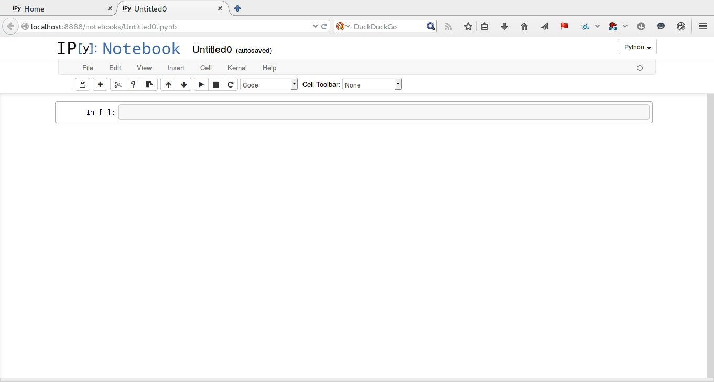
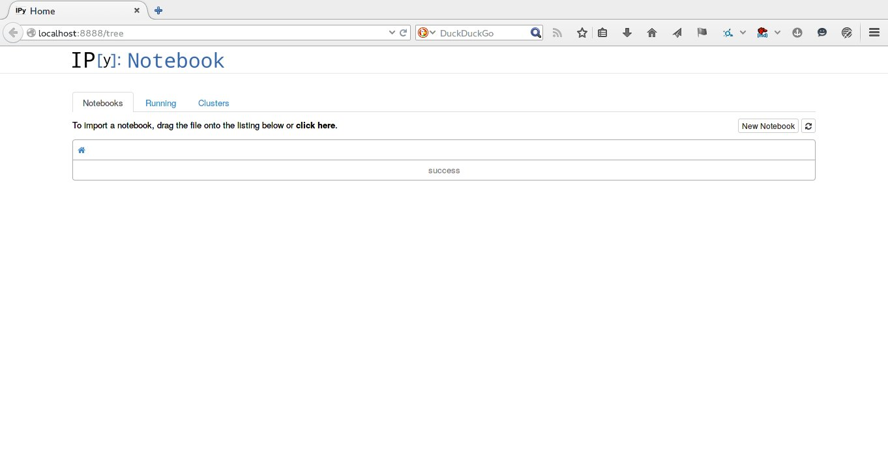

## Objetivos

- Saber o que é Python
- Saber o que é IPython Notebook

## Python

Python é uma linguagem de programação de alto nível que tem sido largamente
adotada pela comunidade científica por ser livre e de propósito geral.

## IPython Notebook

IPython Notebook é uma interface para utilização da linguagem Python de uma
forma que lembra um caderno de laboratório. Essa interface tem sido largamente
utilizada por possuir várias funcionalidades interessantes (e.g.  autocompletar)
e permitir a mistura de código com texto e figuras.

No IPython Notebook um caderno é uma coleção de células (assim como em biologia,
é a menor unidade manipulável). Cada célula possui um tipo/função e pode ser
executada, i.e., processada pelo IPython.

## Dicas

-   O IPython Notebook só consegue ver os arquivos em subdiretórios do diretório
    no qual foi chamado.

    

    Por padrão, o Anaconda é chamado em
-   `tab` é o atalho para autocompletar.
-   `shift+enter` executa a célula.
-   `ctrl+enter` executa a célula e move o cursor para a célula seguinte.
-   `alt+enter` executa a célula e cria uma nova célula embaixo.
-   `alt+-` divide a célula em duas.
-   Ao abrir um caderno para continuar o trabalho interrompido é recomendado
    executar novamente todas as células.
